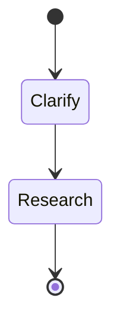
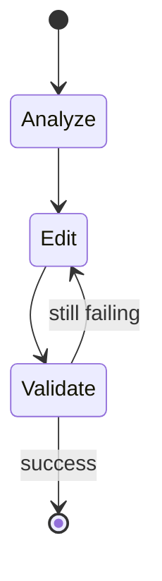

# Copilot Agents

Extended agents for GitHub Copilot in VS Code built on top of default system
prompts. Tested only with DeepSeek API, but should work with any
OpenAI-compatible API.

## Agents

### Explain

A read-only agent with a tendency to show KaTeX math and Mermaid diagrams when
explaining technical concepts. Helpful to understand codebase of a new project.

### Maintain

Runs validation tasks and fixes issues that arise, one at a time. Suitable for
regression testing after changes have been made.

## Usage

Create a new custom agent with `Chat: Configure Custom Agent...` command and
select one of the provided templates.
